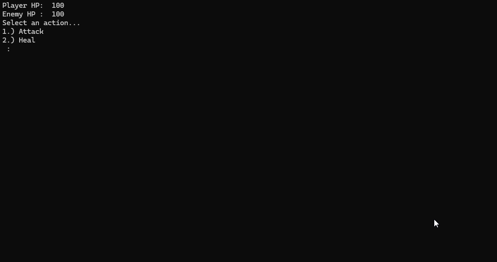

# Menu Based Combat Simulator

Fighting Simulator is a simple, menu-driven combat game written in C++. The player engages in turn-based combat against an enemy, with options to attack or heal. Random number generation determines the outcomes of actions.

## Features

    Turn-based combat
    Random attack and healing values
    Critical hit and miss mechanics

## How to Run
Using an IDE (e.g., Visual Studio, CLion, Code::Blocks)

    Open Your IDE and create a new C++ console project.
    Add Source Files:
        Copy the contents of main.cpp into your project's main source file.
        Include the CIS115-P02S - Menu Driven Combat Simulator.h header file in your project directory.
    Build and Run the project.

Or you could simply run the exe from x64/Debug/Combat Simulator.exe 

## Demo Output

